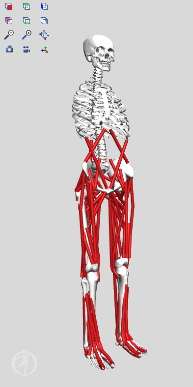
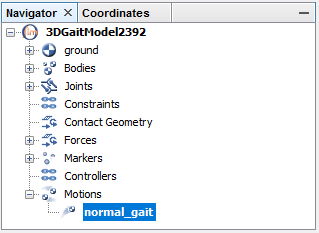
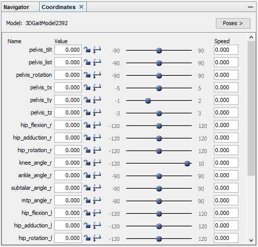
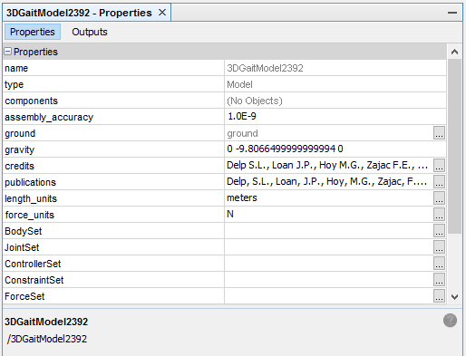

## 目的
本教程的目的是通过演示基于图形的肌肉骨骼建模框架的实用性来研究肌肉肌腱长度和力臂如何取决于肢体配置，从而向用户介绍 OpenSim。在本教程中，您将：

- 熟悉 OpenSim 的图形用户界面 （GUI）。
- 发现肌肉骨骼模型的一些局限性。
- 探索单关节（“1 关节”）和双关节（“2 关节”）肌肉之间的差异。
- 使用 OpenSim 解决重要的临床问题
  
## OpenSim [界面简介](https://opensimconfluence.atlassian.net/wiki/spaces/OpenSim/pages/53089894/Graphical+User+Interface)
|标题|截图| 
|:--|--:|
|工具栏|
|运动文本框|
|运动滑块|
|实物窗口|
|导航器窗口(Navigator Window)|
|坐标窗口(Coordinates Window)|
|属性窗口(Properties Window	)|

## 下肢肌肉骨骼模型
在本节中，您将下肢模型加载到 OpenSim 中，并使模型“行走”。该模型代表一个成年受试者，身高约 1.8 m，体重约 75 kg。该模型由 13 个刚体段组成，包括 92 块肌肉的作用线（每条腿 43 块，躯干 6 块）

__加载模型__ 

第一个加载分析的模型是gait2392_simbody.osim
- 单击“**file**“菜单，然后选择”**Open Model**“。
- 在新弹出的窗口里找到Models文件夹
- 打开Gait2392_simbody文件夹，选择文件 gait2392_simbody.osim，然后单击打开。
  
加载模型后，导航器窗口将显示具有给定模型名称的模型，如果打开多个模型，您可以更改此模型名称以区分每个模型。“导航器”窗口还提供有关模型中身体、肌肉和关节的特定信息。如果“导航器”窗口不可见，请单击“**窗口**”菜单并选择“**导航器**”。使用导航器左侧的按钮展开或折叠标题。

__查看模型__
|摄像机动作|Windows系统操作|
|:--|--:|
旋转|左键单击并按住
平移|右键单击并按住
缩放|向上或向下滚动
